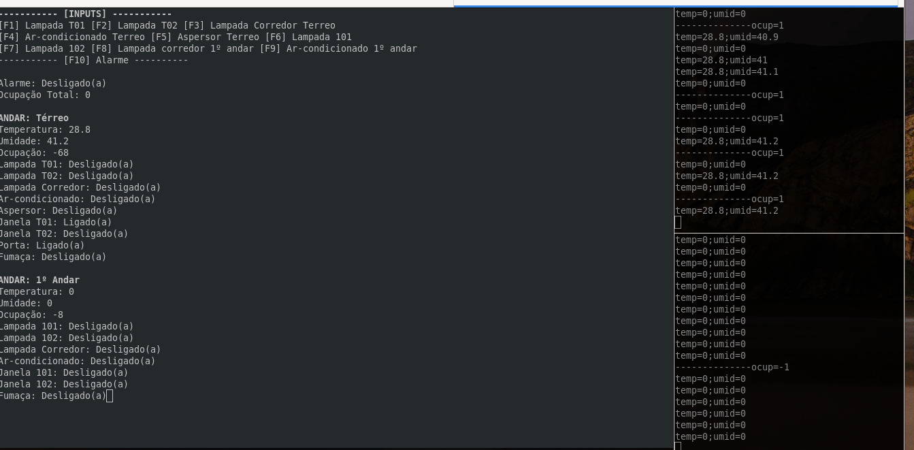

# FSE - Trabalho 2

| Aluno | Matricula |
| --|-- |
| Matheus Gabriel Alves Rodrigues | 180106970 |

## Sobre

O projeto consiste em realizar uma automação predial de um prédio que tem 2 andares,
o sistema será responsável por automatizar o acionamento de um alarme, ligar ou desligar lâmpadas de cada andar,
realizar a contagem de pessoas pelo prédio, etc.



### Observações:

* Recomenda-se executar o **Terreo** primeiro que o **1º Andar**.
* O arquivo de log será gerado dentro da pasta **central**.
* Caso queira executar modificando a porta do central ou o ip, se faz necessário atualizar os arquivos **json** tanto na pasta `central` quanto na pasta `distribuido`.
* Executar o **Central** em uma janela do terminal grande (se possivel em tela cheia) pois o layout montado depende disso.

## Como executar

Na execução desse projeto deve-se executar primeiro o servidor central e depois os distribuidos.

#### Central

O Servidor central foi feito usando a linguagem **python** e para executar o projeto deve se executar o seguinte comando:

```
cd central
python server.py
```

#### Distribuidos

Para executar os sistemas distribuidos foi disponibilizado um arquivo **Makefile** na pasta **Distribuidos**,
os comandos disponiveis são:

* `make all` - Builda a aplicação
* `make clean` - Limpa o os arquivos buildados
* `make terreo` - Executa o distribuido usando o json de configurações do terreo
* `make 1andar` - Executa o distribuido usando o json de configurações do 1º andar


## Comandos

Quando os serviços estiverem em execução as seguintes teclas serão responsáveis por realizar as seguintes tarefas:

* **F1** : Ligar lampada T01
* **F2** : Ligar lampada T02
* **F3** : Ligar lampada corredor terreo
* **F4** : Ligar ar-condicionado terreo
* **F5** : Ligar aspersor
* **F6** : Ligar lampada 101
* **F7** : Ligar lampada 102
* **F8** : Ligar lampada corredor 1º andar
* **F9** : Ligar lampada ar-condicionado 1º andar
* **F10** : Ligar Alarme
